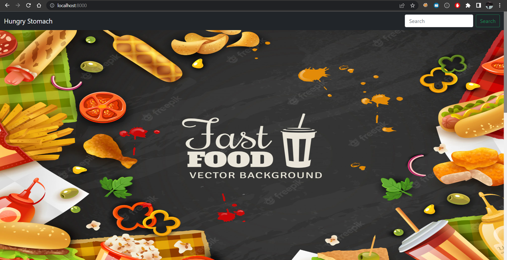
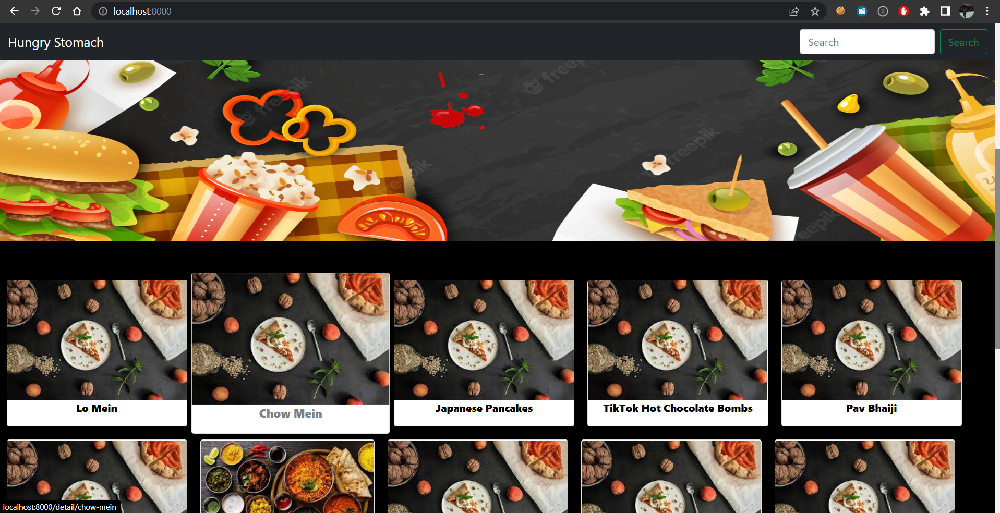
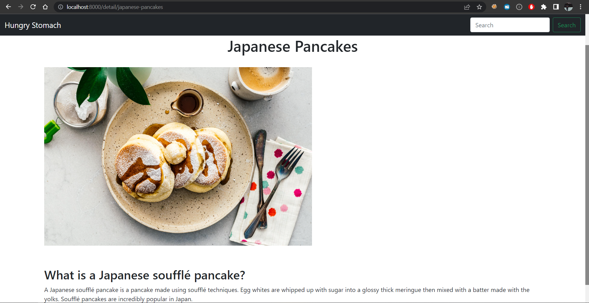
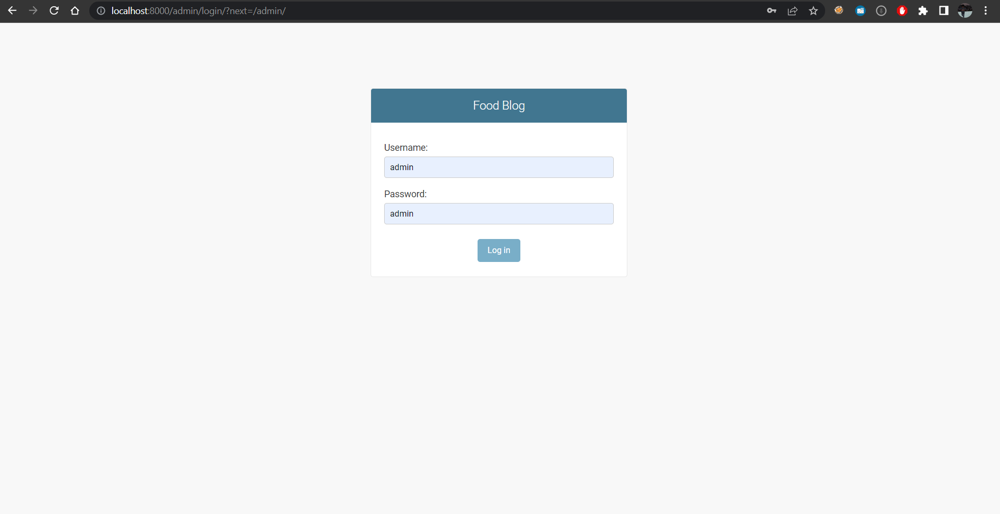
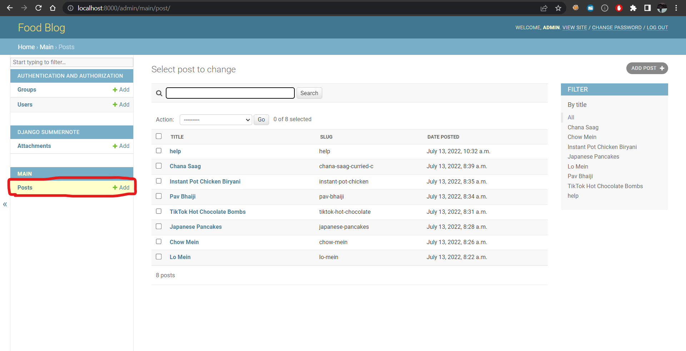
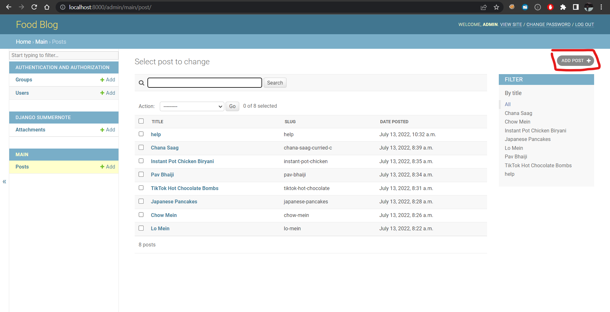
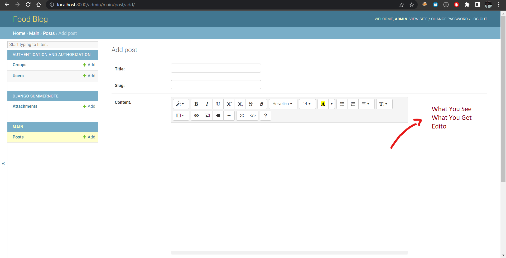
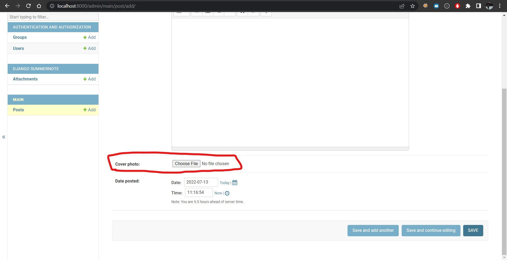

# python 3.10.4

# Steps to Run the Project
- First Clone the Repo
```shell
git clone https://github.com/Aryanamish/dev_wiz_hackthon.git
```
- In the cloned Repo Create a Virtual Environment
```shell
python -m venv venv
```
- Activate the Virtual Environment
```shell
# for windows
venv\source\activate
# for mac and linux
source venv\bin\activate
```
- Install all the requirements
```shell
pip install -r requirements.txt
```

- Running the Server
```shell
python manage.py runserver
```
#### server will be running at http://localhost:8000

# Technologies Used
- Django (Python)
- HTML
- CSS (BootStrap)


## Url's To visit
 ```
    /                       # root site
    /admin                  # admin Site
    /detail/<blog slug>     # blog Page 
 ```

[//]: # (# the username for admin panel is ```admin``` and password is ```admin```)


#Features
- Front Landing Page
- Blog Detail Page
- Login System For the Admins and Staff
- Admin panel (For the Site Owner) can be accessed by going to ```/admin```


# SnapShots of the App

## 1. Index Page

## 2. For Populating the page we have added same Blog Post twice (copy pasta)


# 3. Blog detail Page


# 4. Admin panel (can be accessed on going to '/admin')
### Admin Password is ```admin``` and username is ```admin```


## 5. Adding Post here (It will reflect on the WebsiteSite)


### 6.Adding New Post


### 7.In-Built What You See What you get Editor (_**wuswug**_)


### 8. Cover Photo can also be Added here


#Thank You